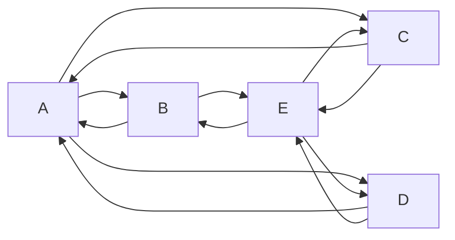
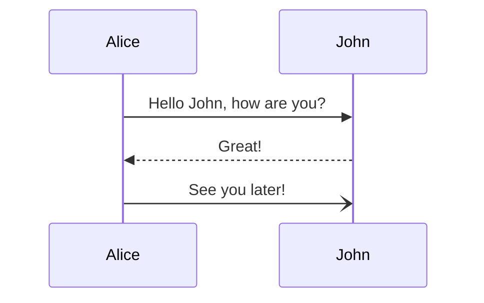
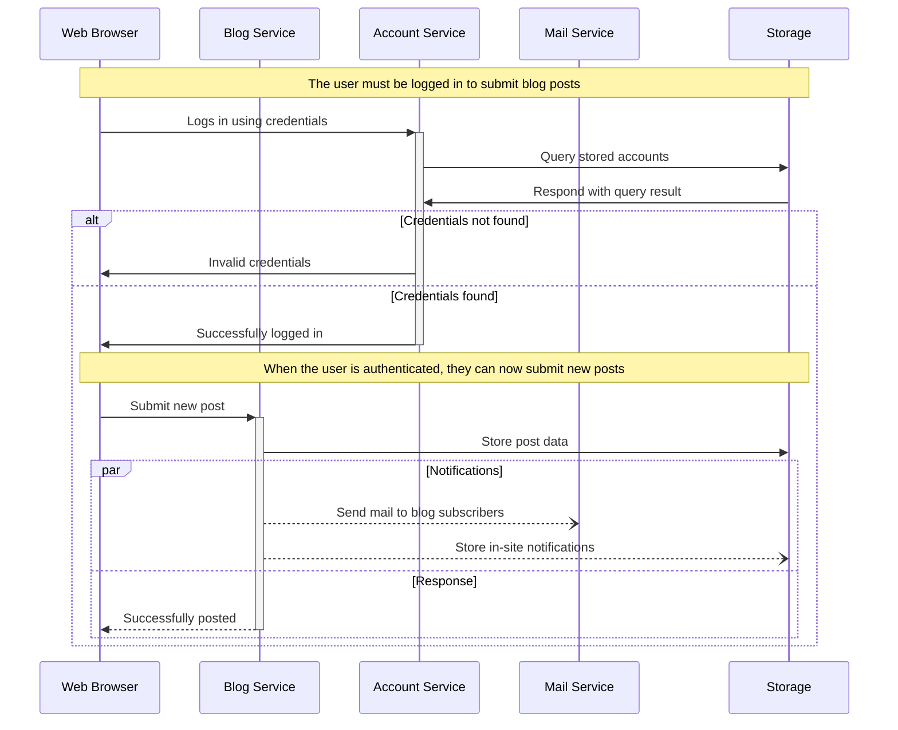

## Mermaid Practice File

I can use mermain on github now, this markdown is practice.

[Mermaid Docs](https://mermaid-js.github.io/mermaid/#/)<br>
[Mermaid Live Code](https://mermaid-js.github.io/mermaid-live-editor/edit#pako:eNp9kdFqwyAUhl9FznXTB8hdiTIC61JMWih44_RkFUws1hRGknef2Zqt2cq80_N95z9yelBOI6SAnhr55mUjWvJ9sn1ZFVvGyTis10NPKHvOD4wfkw2lnJUlSclJXh4aw5AkricFp_GSkrOVCv8l85dDkWcssgKska8WSe28gHvnT_6vFI8KzXWZM_ed0OEHVe6KfgF-Ve6xJK_YNrKmVbbTy7Y7XtB9ViXZpmJPBT_O4u39M6EN0rSPrMXcc4oA5zV61DFv-W1CYAUN-kYaHVfVTzUB4YQNCphEjbXsbJisMaLdWcuATJvgPKS1tBdcgeyCK99bBWnwHc7Qbek3avwA2YaXtA)<br>
[](https://mermaid-js.github.io/mermaid-live-editor/edit#pako:eNpVkE1qw0AMha8itEohvoAXhcZOsgmk0Ow8WQiPnBmS-WEsU4Ltu3ccU2i1kt77nhAasQ2ascRbomjgUisPuT6ayiTbi6P-CkXxPh1ZwAXPzwl2m2OA3oQYrb-9rfxugaAaTwvGIMb6-7xa1St_9jxB3ZwoSojXv87lO0ywb-ynyev_OyZxTh2ajsqOipYSVJReCG7RcXJkdT59XBSFYtixwjK3mjsaHqJQ-TmjQ9QkvNdWQsJS0sBbpEHC19O3v_PK1JbyI9wqzj8k-lxH)

### Graph LR



```
graph LR;
    A--> B & C & D;
    B--> A & E;
    C--> A & E;
    D--> A & E;
    E--> B & C & D;
```

### Sequence Diagram



```
sequenceDiagram
    Alice->>John: Hello John, how are you?
    John-->>Alice: Great!
    Alice-)John: See you later!
```


### Sequence Diagram


```
sequenceDiagram
    participant web as Web Browser
    participant blog as Blog Service
    participant account as Account Service
    participant mail as Mail Service
    participant db as Storage

    Note over web,db: The user must be logged in to submit blog posts
    web->>+account: Logs in using credentials
    account->>db: Query stored accounts
    db->>account: Respond with query result

    alt Credentials not found
        account->>web: Invalid credentials
    else Credentials found
        account->>-web: Successfully logged in

        Note over web,db: When the user is authenticated, they can now submit new posts
        web->>+blog: Submit new post
        blog->>db: Store post data

        par Notifications
            blog--)mail: Send mail to blog subscribers
            blog--)db: Store in-site notifications
        and Response
            blog-->>-web: Successfully posted
        end
    end
```
